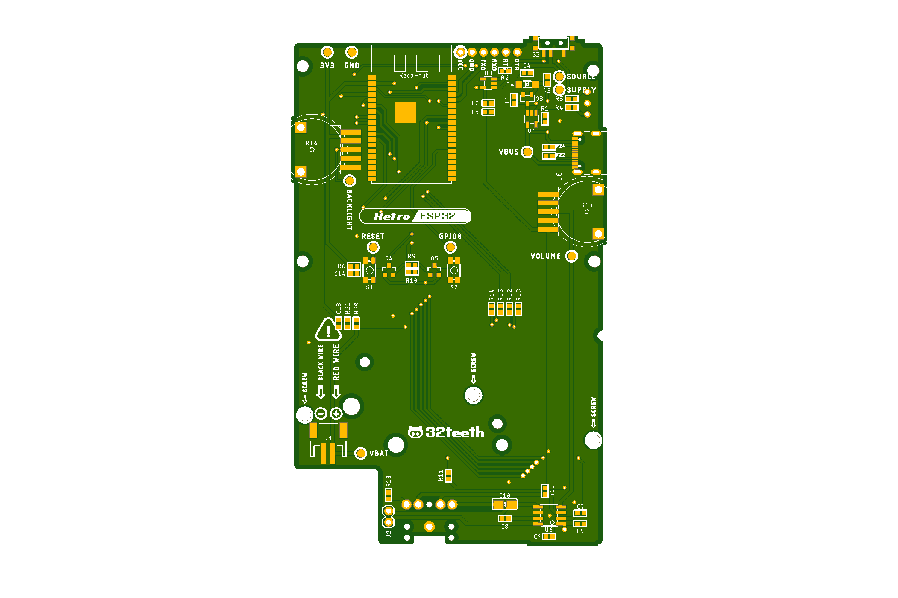

> Gameboy Pocket Drop In PCB

This is an updated release of the previous Retro ESP32 Commercial Hardware PCB.

[Firmware is in another repo](https://github.com/retro-esp32/RetroESP32)

## What's Public

- [x] PCB
- [x] Schematic
- [x] BOM
- [x] Gerber
- [x] DXF

## Updated Features

- [x] 2.6" ILI9342C SPI ISP
- [x] FPC Ribbon Connector
- [x] USB C (Charge Only)
- [x] Serial Pin Breakout

## Images

|      |        |
| ---- | ------ |
| Top  | Bottom |

## Authors

* **Eugene Yevhen Andruszczenko** - *Initial and Ongoing Work* - [32teeth](https://github.com/32teeth)

### License

This project is licensed under the Creative Commons Attribution Share Alike 4.0 International - see the [LICENSE.md](LICENSE.md) file for details

## Support
> Although we do this for 💕 of 🕹️ 
> **We Also Like Coffee!**  
> *Please Consider Supporting*  

Did you know, you can support us in a few way? We offer multiple sposorship tiers, with different rewards!

Take a *look*.
See what *fits*.

 

**Thank You**

